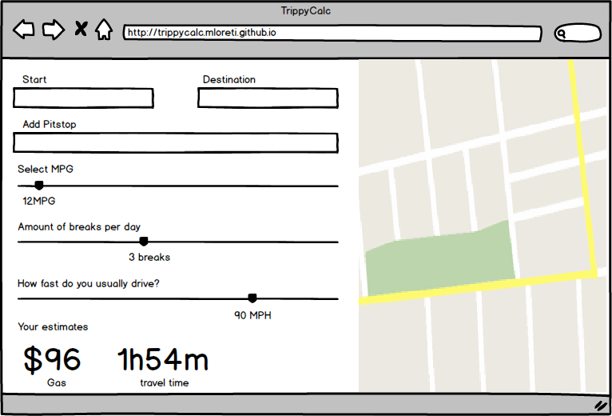

## TrippyCalc

### Background

TrippyCalc is a an interactive way to calculate the cost of a road trip. 

### Functionality & MVP

Users will be able to:

- [ ] Select their car, which will find their avg mpg
- [ ] See a map of their trip
- [ ] Change variables such as food stops and bathroom breaks
- [ ] See a price estimate of the trip
- [ ] Share their trip via email

### Wireframes

This single page app will consist of two main fields. A control panel/input fields on the left and a map on the right. The majority of the users time will be spent adjusting the sliders and input information on the left but the map will also provide a nice visual for the user as well. The main input fields will be car, breaks, food, and destination. 

### Architecture & Technologies

This project will be implement with the following technolgies:

- Vanilla javascript and jquery
- GoogleMaps API for map and directions
- Webpack to bundle JS files
- TBD: other framework likes vue.js/react

### Implementation Timeline

*** Day 1 **: Setup app files and webpack. Setup entry file and ensure webpack and any node dependencies are working.

*** Day 2 **: Get the GoogleMaps api rending a map and using user input to show directions/routes. Gather necessary data for calcuation (car MPG, gas prices, etc...).

*** Day 3 **: Implement sliders and other interactive ways for user to input data.

*** Day 4 **: Find way to share trip information via email/pdf.

