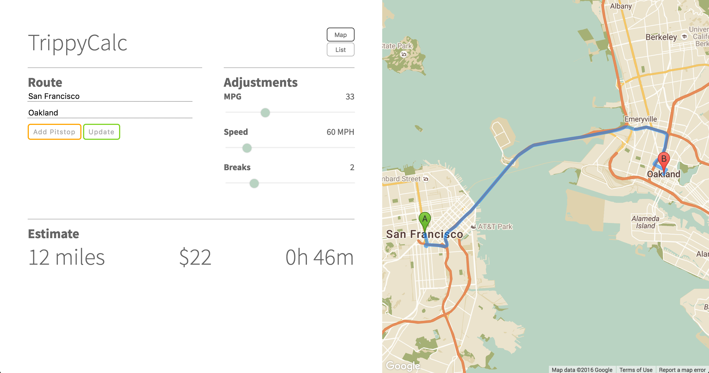

## TrippyCalc  | [Live](mloreti.github.io/trippycalc)




TrippyCalc is a solution for estimating the costs of a road trip. Users simply input their starting location and destination, the route is calculated and displayed on the map. Road trippers then have the option to adjust the details using the sliders in the adjustments section to estimate the cost and time.

### Features

TrippyCalc utilizes the GoogleMaps Javascript API for rendering the map, getting route estimates, and displaying text directions. Additionally, the maps have been restyled and labels have been reduced to provide a cleaner look.

##### Adding pitstops

Users can add pitstops which will update the map, text directions, and estimates by simply clicking `add pitstop`.


### Architecture and Frameworks

TrippyCalc was built with VueJS and jQuery. Vue handled rendering and updating the map as the route and adjustments changed. When a successful request was completed to the GoogleMaps API I would store that response and later use the information to render the data. For examples the directions were saved into an array and displayed on the page using Vue's `v-for`.

```js
getDirections: function(){
  let directions = [];
  let allSteps;
  let legs = this.response.routes[0].legs;
  for(var i = 0; i < legs.length; i++){
    allSteps = (legs[i].steps);
  }
  allSteps.forEach(step => {
    directions.push(step.instructions);
  })
  this.directions = directions;
}
```

The `index.html` file would read this newly saved array and display each item as an li.

```html
<ol>
  <li v-for="steps in directions">
    <span v-html='steps'></span>
  </li>
</ol>
```

### Future Improvements

The future of TrippyCalc is bright. Users will have more sliders in the adjustments panel to more accurately estimate the totals. Users will be able to drag and drop routes in the correct order. And lastly, users will have the ability to export a 1 page summary to email to friends who might be along for the ride.
